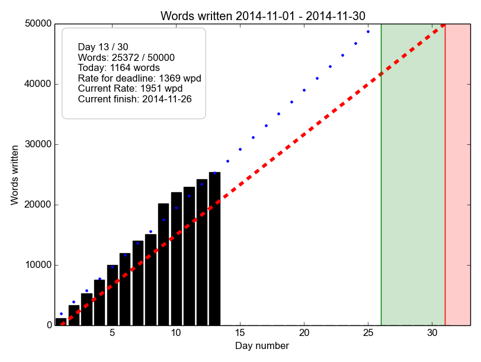

Wordtrack
=========

This is a wordcount tracker that mimics the word-counting mechanism
and statistics shown by [NaNoWriMo](www.nanowrimo.org) (National Novel
Writing Month), a nonprofit-run event where you attempt to write a
novel of 50 000 words during the month of November.

No code of theirs were used and this little program is not in any way
related or endorsed by the NaNoWriMo organization. I just thought
their display was nice and encouraging and would like to have it for
other times of the year too:



```
 Period: 2014-11-01 - 2014-11-30

 Your average per day:  1951
 Words written today:   1164
 Target word count:     50000
 Target average word
        count per day:  1667
 Total words written:   25372
 Words remaining:       24628
 Current day:           13
 Days remaining:        18
 At this rate you
       will finish on:  2014-11-26
 Words per day to
       finish on time:  1369
```

## Install

You need git and Python 2.7. For plotting you also need matplotlib.

Just `cd` to the place you want the program folder to end up and do

```
git clone https://github.com/Griatch/wordtrack.git
```

## Usage

Wordtrack is run from the installation folder, in a terminal.

```
    python wordtrack [start [days [wordgoal]] | plot | <wordcount>]

       arguments:
         start  - start a new period, starting from today
            days - number of days in period (default 30)
            wordgoal - target # of words (default 50 000)
         plot - plot your progress (requires matplotlib)
         <wordcount> - store a new wordcount

      Use without arguments to show current statistics.
```


## Examples

Start a tracking like this:

```
    python wordtrack.py start
```

A new file `wordtrack.txt` will appear in the same directory.  This is
the ascii data file storing the word counts. It's easily
human-readable and you can also edit past word-counts by editing this
file if you should want to. Wordtrack defaults to a time period of 30
days and a word-count goal of 50000 words (NaNoWriMo's default). The
period always starts from the current day.

You can specify other periods and word-goals. To set a period of 20
days and a word-goal of 30 000 words, do:

```
    python wordtrack.py start 20 30000
```

You can only have one period running at a time (if you run `start`
again, you will start over).

To start updating your word count, check your text editor for your
current word count and give it as a number:

```
    python wordtrack.py <wordcount>
```

This registers your current word count and displays the current
statistics. You can update as many times as you want in a day, only
the latest will be stored.

To plot (requires matplotlib), use

```
    python wordtrac.py plot
```

You can view the statistics for the current period by calling
Wordtrack without arguments.
